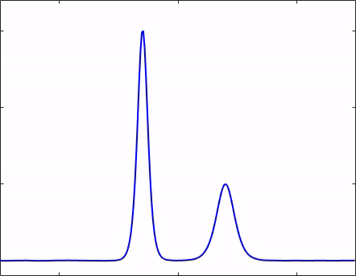

# Spectral_KdV
General, templated implementation of an order 2 semi-implicit  Adams Bashforth/backward‐differentiation time stepping scheme and an order 2 exponential Runge-Kutta method applied to a spectral discretization in space of the Korteweg–de Vries equation with smooth initial data. The methods and application are summarized in the pdf document and supplemented by a short animation depicting the two solitons passing through each other, as computed by my implementation.

